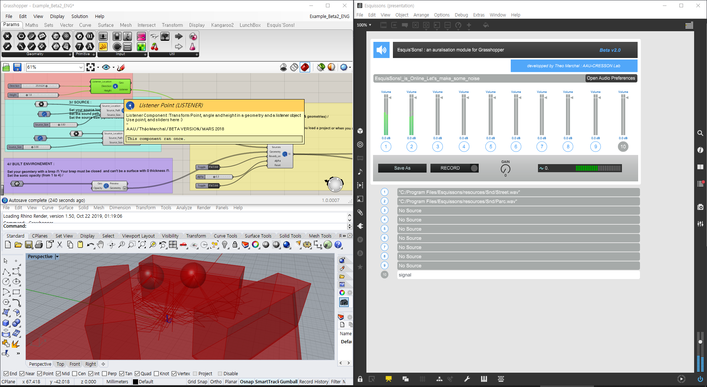

## Esquis'sons

Esquis'Sons! is a [grasshopper](https://www.grasshopper3d.com/) plug-in for simulating sounds in environments created by Théo Marchal.

It is distributed under [CeCILL](https://cecill.info/index.en.html) license and this repository is basically fork or mirror of the project, except there is no way to access source code of the original project.

So this repository is made from binary files downloaded on [food4Rhino](https://www.food4rhino.com/app/esquissons#downloads_list), which is the site providing original plugin.

### Installation

This repository is not ready for install. Please visit the original site: [https://www.food4rhino.com/app/esquissons#downloads_list](https://www.food4rhino.com/app/esquissons#downloads_list)

### Development

#### prequisite

* [max](https://cycling74.com/), tools for sound, graphics and interactivity
* [rhino](https://www.rhino3d.com)
* grasshopper, which is bundled within rhino upper than 6
